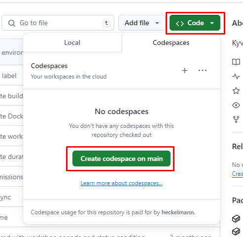
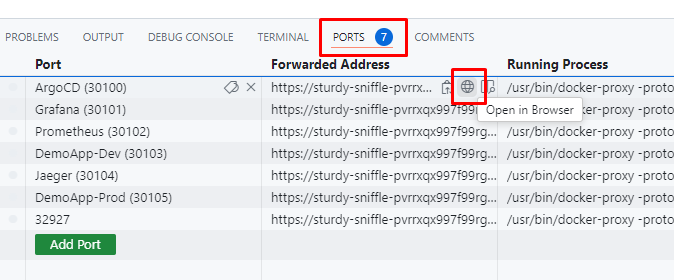
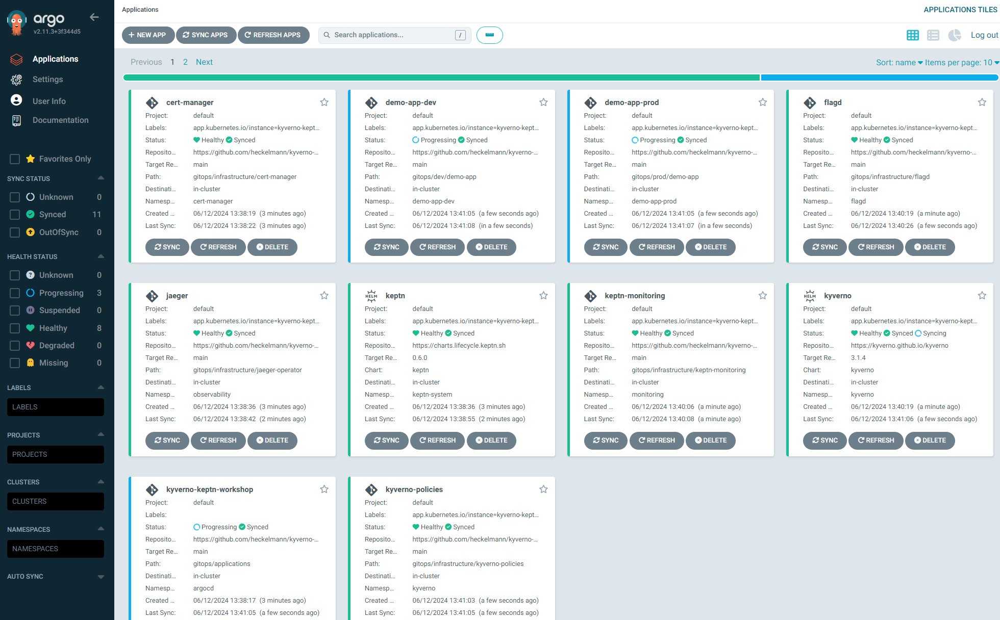

# Create a Lab Environment

## Fork the repository

Go to [heckelmann/kyverno-keptn-workshop](https://github.com/heckelmann/kyverno-keptn-workshop) and fork the repository to your personal GitHub account.

Make sure the forked repository visibility is set to `Public`.


## Start GitHub CodeSpace

In your fork, go to "Code" then switch to the "Codespaces" tab and click "Create codespace on main".



A new window will open with the Codespace. This will take a few minutes to start.

## Start the Workshop Kubernetes Cluster

Open a new Terminal within your Codespace and run the following command:

```bash
> make
Creating KinD cluster
Creating cluster "workshop-cluster" ...
 ✓ Ensuring node image (kindest/node:v1.30.0) 🖼 
 ✓ Preparing nodes 📦  
 ✓ Writing configuration 📜 
 ✓ Starting control-plane 🕹️ 
 ✓ Installing CNI 🔌 
 ✓ Installing StorageClass 💾 
Set kubectl context to "kind-workshop-cluster"

...

application.argoproj.io/kyverno-keptn-workshop created
ArgoCD Admin Password
YOURPASSWORD

🎉 Installation Complete! 🎉
```

This will spin up a KinD Cluster within your Codespace, install ArgoCD and create the `app-of-apps` application, which will deploy all other components.

*Please note the ArgoCD Admin Password, which will be displayed at the end of the installation.* 

You can now access ArgoCD by clicking on the exposed port of your GitHub Code Space



After logging in with the `admin` user and the password displayed during the installation, you will see the ArgoCD Web Console.



## Create GitHub API Token and K8s Secret

Open the GitHub settings and navigate to `Developer settings` -> `Personal access tokens` -> `Fine-grained tokens` (https://github.com/settings/tokens?type=beta).

Select access only to your forked repository and set the permission on `Actions` to `read` and `write` access.

Note down the generated token.


Switch back to your Codespace and create a Kubernetes secret with the token:

```bash
GH_REPO_OWNER=<YOUR_GITHUB_USER>
GH_REPO=<YOUR_GITHUB_REPO>
GH_API_TOKEN=<YOUR_GITHUB_TOKEN>
kubectl create secret generic github-token -n demo-app-dev \
    --from-literal=SECURE_DATA="{\"githubRepo\":\"${GH_REPO}\",\"githubRepoOwner\":\"${GH_REPO_OWNER}\",\"apiToken\":\"${GH_API_TOKEN}\"}"
```
