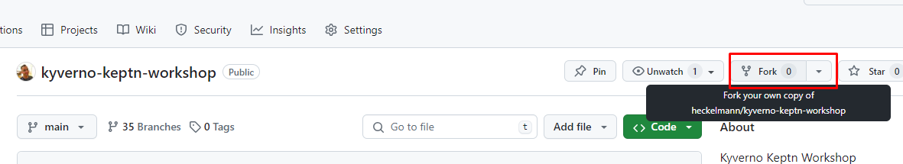
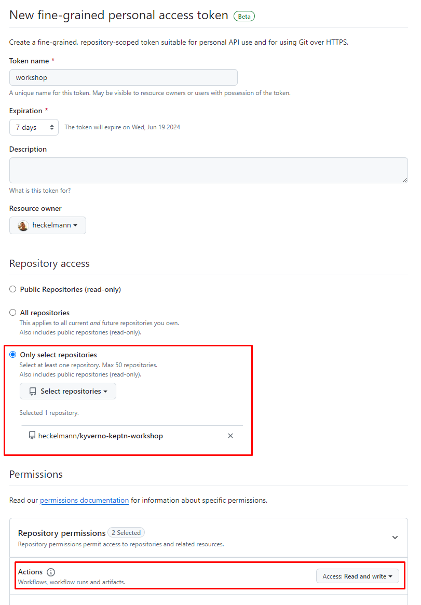

# Create a Lab Environment

## Fork the repository

Go to https://github.com/heckelmann/kyverno-keptn-workshop and fork the repository to your personal GitHub account.

Make sure the forked repository visability is set to `Public`.




## Start GitHub CodeSpace


## Change Application Path

To allow ArgoCD to use the application manifests stored in the `gitops` folder, select the gitops folder and search and replace the `https://github.com/heckelmann/kyverno-keptn-workshop.git` with your Repository URL.


## Create GitHub API Token and K8s Secret

Open the GitHub settings and navigate to `Developer settings` -> `Personal access tokens` -> `Fine-grained tokens` (https://github.com/settings/tokens?type=beta).

Select access only to your forked repository and set the permission on `Actions` to `read` and `write` access.

Note down the generated token.



Switch back to your Codespace and create a Kubernetes secret with the token:

```bash
GH_REPO_OWNER=<YOUR_GITHUB_USER>
GH_REPO=<YOUR_GITHUB_REPO>
GH_API_TOKEN=<YOUR_GITHUB_TOKEN>
kubectl create secret generic github-token -n demo-app-dev --from-literal=SECURE_DATA="{\"githubRepo\":\"${GH_REPO}\",\"githubRepoOwner\":\"${GH_REPO_OWNER}\",\"apiToken\":\"${GH_API_TOKEN}\"}"
```