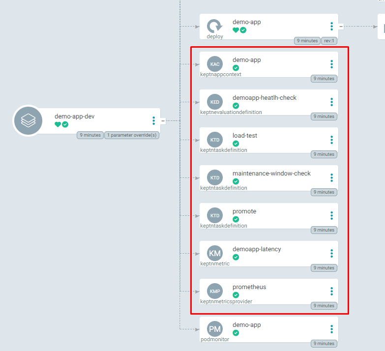

# The System Explained

The workshop environment is now completely installed. If you look at Argo, you will notice a couple things.

A `demo-app-dev` and a `demo-app-prod` is already installed, alongside with all other tools mentioned before.

Inside of the `demo-app-dev` namespace, you will find a couple of resources such as:

- `KeptnAppContext`
- `KeptnTaskDefinition`
- `KeptnEvaluationDefinition`
- `KeptnMetric`
- `KeptnMetricsProvider`

