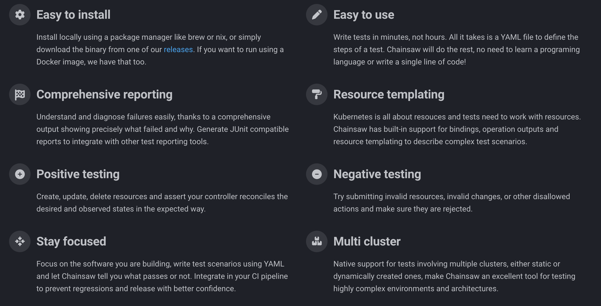

# Chainsaw

During the workshop, you will interact with the following components:

- [`Test`](#test)

## Chainsaw in a Nutshell

Chainsaw is a declarative, yet very powerful and flexible, end-to-end testing tool especially well suited to test Kubernetes operators and controllers.



Read the [Chainsaw Quick Start](https://kyverno.github.io/chainsaw/latest/quick-start/) to learn more about Chainsaw.

## Test

To put it simply, a [Test](https://kyverno.github.io/chainsaw/latest/reference/apis/chainsaw.v1alpha1/#chainsaw-kyverno-io-v1alpha1-Test) can be represented as an ordered sequence of test steps.

In turn, a [test step](https://kyverno.github.io/chainsaw/latest/reference/apis/chainsaw.v1alpha1/#chainsaw-kyverno-io-v1alpha1-TestStepSpec) can be represented as an ordered sequence of operations.

- When an operation fails the test is considered failed
- If all operations succeed the test is considered successful

```yaml

apiVersion: chainsaw.kyverno.io/v1alpha1
kind: Test
metadata:
  name: dev-app
spec:
  namespace: argocd
  steps:
  - try:
    - assert:
        timeout: 5m
        resource:
          apiVersion: argoproj.io/v1alpha1
          kind: Application
          metadata:
            name: demo-app-dev
          status:
            health:
              status: Healthy
            sync:
              status: Synced
    - assert:
        timeout: 5m
        resource:
          apiVersion: lifecycle.keptn.sh/v1
          kind: KeptnApp
          metadata:
            name: demo-app
            namespace: demo-app-dev

```

This test is made of one step containing two operations (assertions).
The test will verify the presence of the mentioned resources in the cluster, and if present, it will check those resources are in the expected state.
