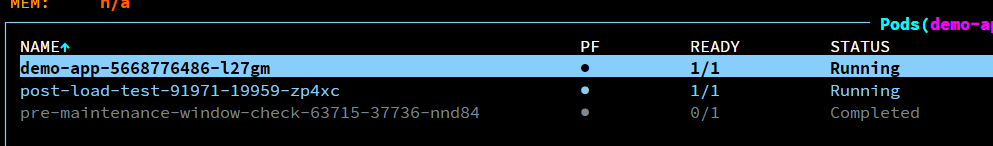
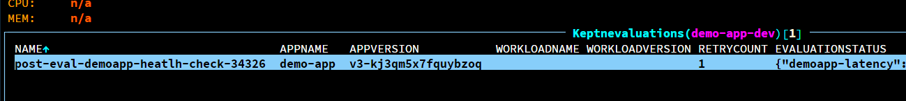
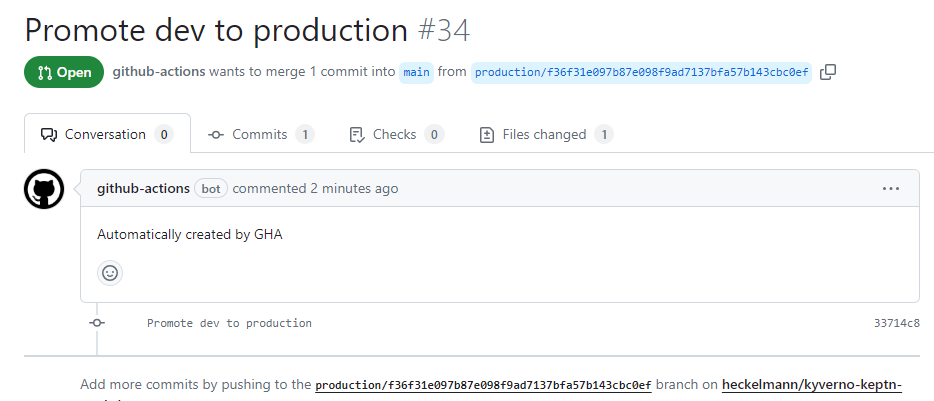

# Evaluate and Promote Deployments

You will learn how to prevent the promotion of a new version of your application if the KeptnEvaluation fails and how to use the promotion task to promote the deployment to the next environment.

We will run a K6 Load Test as Post-Deployment Task to generate load on the application and calculate the average latency. After we will analyze the results and promote the deployment to the production environment if the evaluation passes.

!!! note
    
    Please note that the evaluation of the performance is based on a simple example and should be adapted to your specific use case.

See `gitops/dev/demo-app-dev/templates/podmonitor.yaml` for the Prometheus PodMonitor configuration.

## Exercise

### Create a keptnMetricsProvider

Create a new file `metrics-provider.yaml` in the `gitops/dev/demo-app-dev/templates` folder of your repository and add the following content:

```yaml
apiVersion: metrics.keptn.sh/v1alpha3
kind: KeptnMetricsProvider
metadata:
  name: prometheus
  namespace: demo-app-dev
spec:
  type: prometheus
  targetServer: "http://prometheus-operated.monitoring.svc.cluster.local:9090"
```

The metrics provider is used to define the data source for the metrics that are used in the evaluation. The Datasource could be Prometheus, Thanos, Cortex, Dynatrace, or Datadog.

See [KeptnMetricsProvider](https://keptn.sh/stable/docs/reference/crd-reference/metric/) for more information.

### Create a keptnMetric

Create a new file `keptn-metric.yaml` in the `gitops/dev/demo-app-dev/templates` folder of your repository and add the following content:

```yaml
apiVersion: metrics.keptn.sh/v1alpha3
kind: KeptnMetric
metadata:
  name: demoapp-latency
  namespace: demo-app-dev
spec:
  provider:
    name: prometheus
  query: 'sum by (path) (rate(http_request_duration_seconds_sum{namespace="demo-app-dev", path="/"}[2m]) / rate(http_request_duration_seconds_count{namespace="demo-app-dev", path="/"}[2m]))'
  fetchIntervalSeconds: 5
```

The metric is used to define the query that is used to fetch the data from the data source. In this case, we are calculating the average latency of the application.

### Create a KeptnEvaluationDefinition

Create a new file `evaluation-definition.yaml` in the `gitops/dev/demo-app-dev/templates` folder of your repository and add the following content:

```yaml
apiVersion: lifecycle.keptn.sh/v1alpha3
kind: KeptnEvaluationDefinition
metadata:
  name: demoapp-heatlh-check
  namespace: demo-app-dev
spec:
  objectives:
    - keptnMetricRef:
        name: demoapp-latency
        namespace: demo-app-dev
      evaluationTarget: "<1" #less than 1s
```

The evaluation definition is used to define the objectives that need to be met for the evaluation to pass. In this case, we are checking if the average latency of the application is less than 1 second.

### Create a Load Test Task

Create a new file `load-test-task.yaml` in the `gitops/dev/demo-app-dev/templates` folder of your repository and add the following content:

```yaml
apiVersion: lifecycle.keptn.sh/v1alpha3
kind: KeptnTaskDefinition
metadata:
  name: load-test
  namespace: demo-app-dev
spec:
  retries: 0
  timeout: "5m"
  container:
    name: k6-test
    image: grafana/k6:0.45.0
    command:
      - 'k6'
      - 'run'
      - 'https://raw.githubusercontent.com/heckelmann/kyverno-keptn-workshop/main/tasks/load-dev.js'
```

This TaskDefinition differs from the pre-deployment task we created before by not using the built-in function runtimes, but instead running a container with the k6 image. The k6 image is a popular tool for load testing and can be used to generate load on the application.

### Create a Promotion Task

Create a new file `promotion-task.yaml` in the `gitops/dev/demo-app-dev/templates` folder of your repository and add the following content:

```yaml
apiVersion: lifecycle.keptn.sh/v1
kind: KeptnTaskDefinition
metadata:
  name: promote
  namespace: demo-app-dev
spec:
  container:
    name: promote
    env:
    - name: ACTION
      value: promote
    - name: SECURE_DATA
      valueFrom:
        secretKeyRef:
          key: SECURE_DATA
          name: github-token
    image: ghcr.io/heckelmann/workshop-registry/promote:latest
```

The promotion task is used to promote the deployment to a different environment. In this case, we are promoting the deployment to the production environment, by triggering a GitHub Action which creates a Pull Request in your repository.

Please note that we are using the secret which has been created in a previous step to authenticate with GitHub.


### Update the KeptnAppContext

Add the following to your `KeptnAppContext` in the `gitops/dev/demo-app-dev/templates/keptn.yaml`:

```yaml
apiVersion: lifecycle.keptn.sh/v1
kind: KeptnAppContext
metadata:
  name: demo-app
  namespace: demo-app-dev
spec:
  postDeploymentTasks:
    - load-test
  postDeploymentEvaluations:
    - demoapp-heatlh-check
  promotionTasks:
    - promote
```


### Apply the changes

Commit and push the changes to your repository and wait for the deployment to finish.

### Demo

Use K9 to check the status of the deployment and the load test.

Change the Version in `gitops/dev/demo-app/values.yaml` to `v2` and commit and push the changes to your repository.	

ArgoCD should start to sync the `demo-app-dev` application and deploy the new version of the application.



The evaluation will fail because the average latency of the application is higher than 1 second, and no promotion will be triggered.

Now change back the Version in `gitops/dev/demo-app/values.yaml` to `v1` and commit and push the changes to your repository.

The evaluation will pass because the average latency of the application is less than 1 second, and the promotion will be triggered.



```bash
k -n demo-app-dev get keptnevaluation
NAME                                   APPNAME    APPVERSION            WORKLOADNAME   WORKLOADVERSION   RETRYCOUNT   EVALUATIONSTATUS                                                                                                                             OVERALLSTATUS
post-eval-demoapp-heatlh-check-17614   demo-app   v2-4y4hftehfeyu7den                                    10           {"demoapp-latency":{"message":"value '4.572755924142906' did not meet objective '\u003c1'","status":"Failed","value":"4.572755924142906"}}   Failed
```

You should see a new Pull Request in your repository which promotes the deployment to the production environment.

