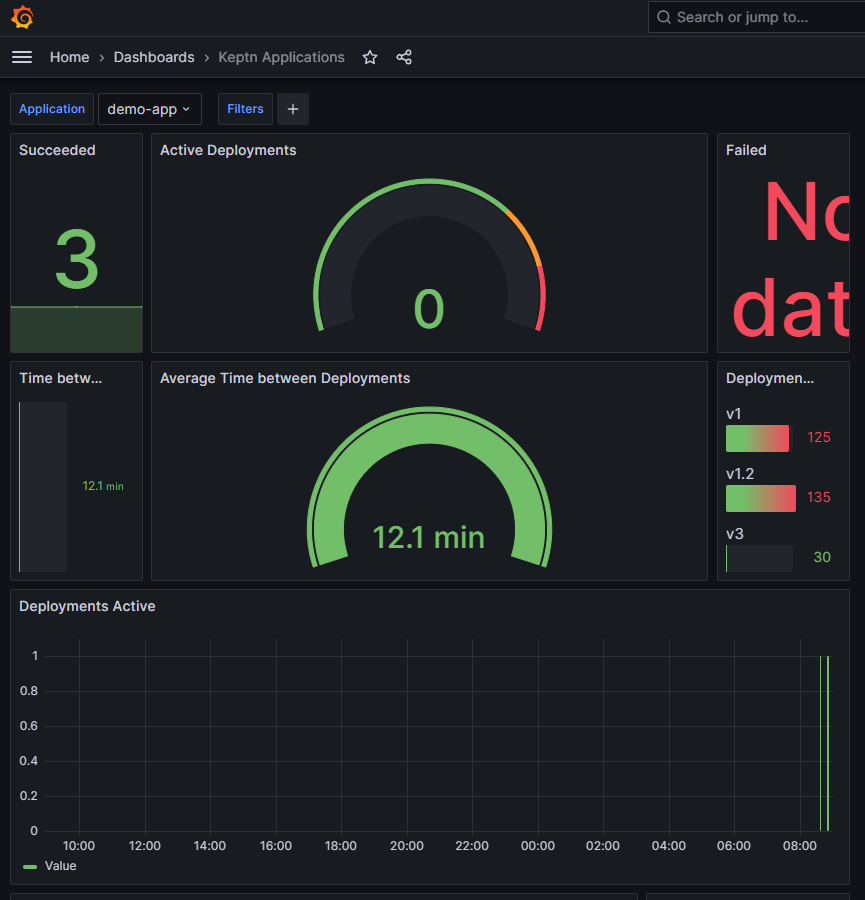

# Deployment Observability

Keptn makes every Deployment observable using OpenTelemetry by creating a distributed trace of what Kubernetes is doing during the deployment. This trace is then sent to a backend, such as Jaeger, where it can be analyzed.

During our workshop we already deployed multiple services and applications using Keptn. Let's have a look at the traces that were created during the deployment of our demo application.

Open Grafana, which has been deployed on Port `30101` in our workshop environment.

Login with username `admin` and password `admin`.

Traces from different stages are linked together, so you get an end-to-end trace from the start of your application beginning on dev to the end of the application in production.

