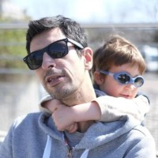

# Boss I crashed Production again!

{ align=center, width=400 }

## The Kyverno & Keptn Workshop

In this workshop, you will learn how to build and deploy applications with security, observability, and reliability in mind. We will use Chainsaw to ensure your application behaves correctly, Kyverno to validate and enforce security policies in CI/CD Pipelines and Runtime. Furthermore, you will learn how to make your deployment observable with Keptn and how to automate the promotion of your application through different stages with a GitOps approach.

## Who we are

{ align=left }
### *Charles-Edouard Brétéché*

Staff Engineer at Nirmata

[:simple-linkedin: LinkedIn](https://www.linkedin.com/in/eddycharly/)

 
 

{ align=left }
### *Christian Heckelmann*

Cloud Engineer at Dynatrace

[:simple-linkedin: LinkedIn](https://www.linkedin.com/in/christian-heckelmann-82375a25/)

[:material-twitter: @wurstsalat](https://twitter.com/wurstsalat)